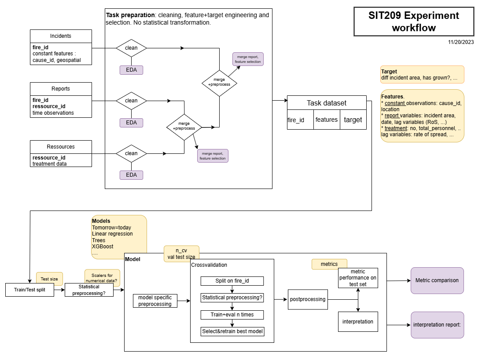
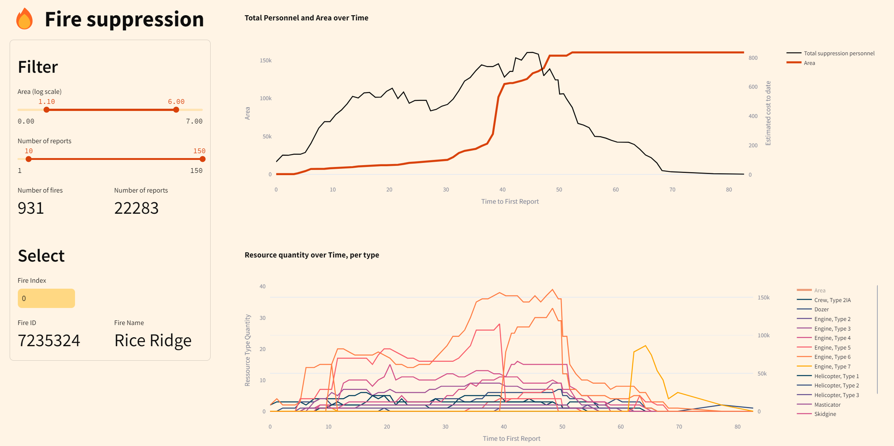

# Fire suppression study

Analysis of fire suppression study data from the US Forest Service. The purpose is to create a model that can predict the evolution of a fire given its past. In particular, we are interested in proxies of threat such that the optimziation model can prescribe suppression ressources depending on the threat priority.

I recommend installing the project dependencies with [uv](https://github.com/astral-sh/uv) (it's like pip+venv+pyenv but better and faster) but pip will do the job just fine.

## What does this repo contains?

Most of my work has been done in notebooks, spread over multiple projects.

It contains:

* scripts to preprocess, visualize and clean the data
* a dashboard to visualize, understand, and "debug" the data
* models to predict the growth of the area over time with and without satellite images
* scripts to dowload satellite images covariates from Google Earth Engine, inspired by the [next-day wildfire spread](https://arxiv.org/abs/2112.02447). The scripts uplaod the data to Google Cloud Storage.
* optimization project: optimize the allocation of the resources to minimize fire induced cost (projected with a toy model)
* computer vision project: use deep learning and add physics prior to learn to predict the next-day wildfire spread over [satellite images](https://arxiv.org/abs/2112.02447)



## Data

### Raw data

The dataset has been extracted from the SIT209 dataset, on a time period of 2015-2018.

An incident corresponds to a fire that has been reported at least once.

A report contains a snapshot of the evolution of the fire. There is usually a report a day, but often some reports are missing.

A resource contains for each report the operational data about suppression resources (number of fire trucks etc)

The raw data should be in the `data/true_raw` folder (4 CSV files).

### Cleaned data

Each of these datasets has been individually cleaned: date cleaning, adjusted/merged some categories whose names were changing throug the years.The code for cleaning is in their respective respective notebooks. Cleaned columns sgiykd have lowercase names.
Cleaned data should be in the `data/cleaned` folder (3 files).

### Preprocessed

Finally, these three datasets have been merged and preprocessed for further analysis. At this step, no imputation has been performed.
Preprocessed data is available in the `data/preprocessed` folder (1 file)

## App

To help visualize the wildfire reports (multidimensional time series), I built a small streamlit webapp. It is possible to iterate through the different fires (identified by `fire_id`), to search specific ones, and to filter accordingly to some quantities of interest. The app is very nice to get a sense of the different types of fires and how different variables tend to evolve.



```
python streamlit run app.py
```

You can see spikes : a value going to 0 or skyrocketting. This can be cleaned by a low pass filter/thresholding/dropping out extreme values.

## State of the project and future directions

I have scanned most of the data: it contains a rich signal spread over a vast number of features. The observations are noisy since the data is sourced from human inputs (certainly various operators behind computers filling/transcribing surveys). The data has a very important temporal dimension that is sometimes hard to process since the spacing between reports is not constant.

The main restriction in our modeling is the target, which is needed to be a signal of high quality when working in supervised settings. Here, the evolution of the area is very noisy, and the autocorellation is very low. To work with it, I think that strong low-pass filters are needed (keeping area increasing, replacing outliers with interpolation, ...). I think that increasing the assumptions and restricting the datasets to "nice" fires could defintely make this work though.

We spent some efforts gathering a dataset of satellite images on GEE. This was not that helpful because the charateristic length of atmospheric variables is large, therefore most fire spread covariates are constant over images: a point is already information-rich enough. Also we were predicting the area growth so the previous problem definetly interferes here. Getting the fire mask would a good source of targets but it might be overkill for the problem at hand (I ran some experiments during the cv project over a nice dataset, it is easy to make an "ok" model and hard to make a very good one).

Also there are many columns with text data. The signal here is very rich as the operator describes the threat level and the priority, as well as general plans. I ran some experiemnts using BERT embeddings and found positive signal, but we did not pursue this path more.

Basically, I believe that just trying with a linear regression to predict something would work. I think in general the approach to solving this problem would benefit from trying the simplest things and reduce uncertainty as much as possible.

## Miscellenaous advices

in jupyter notebooks, use

```
%load_ext autoreload
%autoreload 2
```

to not have to reload the kernel if you modify dependencies content (for instance scripts you are modifying and that you are calling in the notebook)

use [uv](https://docs.astral.sh/uv/) to manage python dependencies and environments
